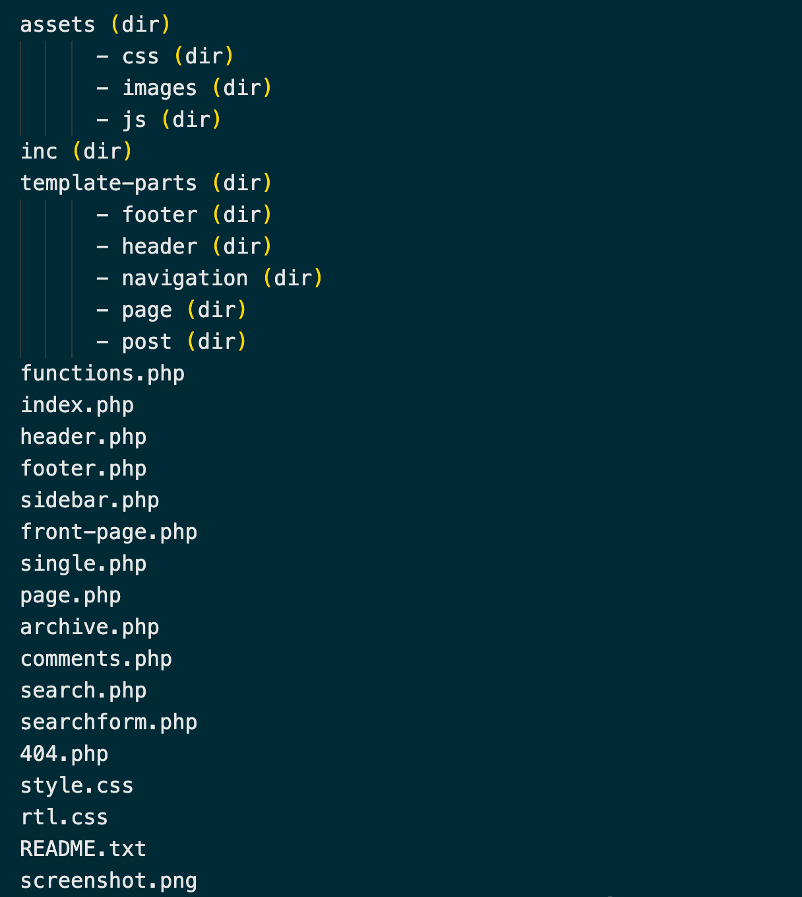

# THEME (PHẦN 1)

Theme trong Wordpress (WP) bao gồm 1 hoặc nhiều mẫu giao diện được thiết kế sẵn, có những đặc trưng riêng về giao diện, bố cục, cách trình bày nội dung khác nhau.
Không những vậy, theme còn hỗ trợ các tính năng khác nhau cho những loại trang web khác nhau.
Ta có thể thay đổi theme dễ dàng trên trang Admin mà không cần phải thiết lập code.


## 1. FILE TỐI THIỂU VÀ THÔNG TIN CỦA THEME

Theme trong WP cần tối thiểu các file:
+ **index.php**
+ **style.css**

Trong đó thông tin của theme sẽ được ghi trong phần stylesheet header ở phía trên cùng của file **style.css**

``` css
/*
Theme Name: RubyTheme
Theme URI: http://rubytheme.com/
Author: Haibach / Nguyễn Văn Thy
Author URI: http://haibach.net/
Description: Rubytheme theme
Requires at least: WordPress 4.9.6
Version: 1.0
Text Domain: rubytheme
Tags: custom-background, custom-logo, custom-menu, featured-images, threaded-comments, translation-ready

Normalizing styles have been helped along thanks to the fine work of
Nicolas Gallagher and Jonathan Neal https://necolas.github.io/normalize.css/
*/
```


## 2. CẤU TRÚC CƠ BẢN CỦA CÁC FOLDER VÀ FILE TRONG THEME

Đây là cấu trúc cơ bản của 1 theme trong WP, bao gồm các file cần thiết để hoạt động.
Ta có thể thêm các file hoặc folder khác vào cấu trúc này, để thiết lập các tính năng khác cho theme.




## 3. TEMPLATE FILES

**A/ Phân biệt các thuật ngữ "template" trong Wordpress**

**Template files** : là các file tồn tại trong theme, nó sẽ hiển thị ra giao diện của theme được chỉ định.

**Page templates** : được sử dụng để thay đổi giao diện của các trang (kiểu post page). Page templates có thể thay đổi giao của 1 trang, hoặc nhiều trang khác nhau.

**Template tags** : là những function được xây dựng sẵn trong WP, được sử dụng bên trong các template files, để nhận và hiển thị thông tin / data.

**Template hierarchy** : cấu trúc logic được WP sử dụng để quyết định template files nào trong theme được sử dụng, tuỳ thuộc vào nội dung
được yêu cầu.


**B/ Danh sách các template files cơ bản và được hỗ trợ bởi WP**

- **index.php** : là file template chính, bắt buộc phải có ở mọi theme.

- **style.css** : là file stylesheet chính, bắt buộc phải có ở mọi theme và chứa thông tin của theme ở phần header.

- **rtl.css** : right-to-left stylesheet được đưa vào tự động nếu trang web có text theo hướng phải sang trái.

- **comments.php** : là template về comment.

- **front-page.php** : nếu file template này tồn tại trong theme thì sẽ luôn hiển thị trang Home/Top đầu tiên. Thường sử dụng để hiển thị nội dung của trang tĩnh hoặc blog, được thiết lập trong trang Admin ở menu: **Settings > Reading**
Thứ tự ưu tiên hiển thị trang Home/Top theo file template: **front-page.php > home.php > index.php**

- **home.php** : là template hiển thị trang Home/Top mặc định trong WP, nếu không thiết lập trang front tĩnh thì template này sẽ được hiển thị,
với những bài viết blog mới nhất.

- **header.php** : template thường chứa thông tin của doctype, link của stylesheet, script và các data khác (thông thường sẽ bao gồm toàn bộ thẻ <head>)

- **single.php** : hiển thị bài viết post khi người dùng yêu cầu.

- **single-{post-type}.php** : tương tự như template single.php nhưng được sử dụng cho custom post type.
Nếu file không tồn tại thì custom post type sẽ lấy file index.php để hiển thị.

- **archive-{post-type}.php** : template hiển thị archive của custom post type. Ví dụ custom post type có tên là books
thì template archive là archive-books.php, nếu template không tồn tại thì tempate archive.php sẽ được hiển thị thay thế.

- **page.php** : hiển thị các trang cá nhân, là mẫu template xây dựng sẵn, ta có thể clone template để hiển thị cho các trang đặc biệt khác.

- **page-{slug}.php** : hiển thị cho các trang cá nhân đặc biệt. Ví dụ trang có slug là "about" thì file template có tên là page-about.php

- **category.php** : hiển thị tất cả bài post có cùng category.

- **tag.php** : hiển thị tất cả bài post có cùng tag.

- **taxonomy.php** : hiển thị tất cả bài post cùng custom taxonomy.

- **author.php** : hiển thị thông tin của tác giả.

- **date.php** : hiển thị các bài post đươc yêu cầu bằng date hoặc time. VD: như các trang các đường dẫn:
https://mypage.com/blog/2021/12/

- **archive.php** : template hiển thị các bài post được yêu cầu bởi category, author hoặc date. Lưu ý là template này sẽ bị ghi đè
nếu có các template category.php, author.php, date.php

- **search.php** : hiển thị kết quả tìm kiếm.

- **attachment.php** : template được sử dụng để hiển thị 1 file đơn lẻ như hình ảnh, pdf, hoặc media file.

- **image.php** : template dành riêng để hiển thị hình ảnh đơn lẻ. Nếu template không tồn tại thì WP sẽ sử dụng template attachment.php
để thay thế.

- **404.php** : template được hiển thị khi WP không tìm thấy bài post, trang web, hay nội dung mà người dùng yêu cầu.


**C/ Template partials**

Template partials là những phần nhỏ của các template files, nó thường được nhúng vào các template files khác, thường hay sử dụng
do tính lập lại, tái sử dụng và dễ quản lý các phần. Các template partials thông dụng: 

+ header.php : sử dụng cho site header
+ sidebar.php : sử dụng cho site sidebar
+ footer.php : sử dụng cho site footer


**D/ Sử dụng template files**

Trong WP ta sử dụng template tags để chèn các template file khác vào template hiện tại.

+ Liên kết với file header.php trong theme, ta sử dụng get_header()
+ Liên kết với file sidebar.php trong theme, ta sử dụng get_sidebar()
+ Liên kết với file footer.php trong theme, ta sử dụng get_footer()
+ Liên kết với search form, ta sử dụng get_search_form()
+ Liên kết với 1 custom file của theme, ta sử dụng get_template_part()


Ví dụ thực tế:

``` php
<?php get_sidebar(); ?>
<?php get_template_part( 'feature-conent' ); ?>
<?php get_footer(); ?>
```


## 4. TEMPLATES TAGS

Template tags là những function được xây dựng sẵn trong WP, được sử dụng bên trong các template files, để nhận và hiển thị
thông tin / data.

Template tags trong WP được hỗ trợ rất đầy đủ, với số lượng lên đến hàng trăm.

✱✱[Danh sách template tags đầy đủ ở đây.](https://developer.wordpress.org/themes/references/list-of-template-tags/)✱✱

Do đó, sau đây là những template tags thường hay sử dụng:

Template tags liên kết template file / template partials

- **get_header()** : liên kết với file header.php trong theme.
- **get_sidebar()** : liên kết với file sidebar.php trong theme.
- **get_footer()** : liên kết với file footer.php trong theme.

Template tags chức năng

- **wp_head()** : hook mặc định của WP để hiển thị thông tin, chèn script, css... vào tags <head> của site.
- **wp_footer()** : hook mặc định của WP sử dụng để chèn thông tin, data ở footer. Lưu ý là 1 số theme sẽ không sử dụng template tag này.
- **bloginfo()** / **get_bloginfo()** : hiển thị thông tin của site, có nhiều thông tin như name, description, url ... (danh sách đầy đủ ở đây).
Cả 2 template tags đều có chức năng giống nhau, nhưng bloginfo() sẽ lấy và hiển thị thông tin luôn, còn get_bloginfo() chỉ lấy thông tin của site.
- **wp_nav_menu()** : hiển thị Menu location.
- **dynamic_sidebar()** : hiển thị 1 sidebar.
- **home_url()** : hiển thị địa chỉ của site hiện tại, được thiết lập trong Admin ở menu **Setting > General > Site Address (URL)**

Template tags về Post, Page, Category

Các template tags này chỉ sử dụng được và đúng khi ở trong 1 vòng truy vấn của WP (Loop).

- **the_title()** : hiển thị tiêu đề của post hiện tại.
- **the_content()** : hiển thị nội dung của post hiện tại.
- **the_excerpt()** : hiển thị phần excerpt hoặc 1 phần nội dung của post hiện tại.
- **the_permalink()** : hiển thị permalink của post hiện tại.
- **the_author()** : hiển thị tên tác giả của post hiện tại.
- **the_ID()** : hiển thị id của bài post hiện tại.
- **the_tags()** : hiển thị danh sách tags của post hiện tại.
- **the_category()** : hiển thị category của post hiện tại.
- **the_class()** : hiển thị danh sách class đặc trưng của post hiện tại.
- **has_post_thumbnail()** : kiểm tra xem post hiện tại có hình ảnh đại diện không.
- **the_post_thumbnail()** : hiển thị hình ảnh đại điện của bài post hiện tại.
- **the_date()** : hiển thị ngày đăng của bài post hiện tại


## 5. LIÊN KẾT FILE VÀ FOLDER

**A/**

Để liên kết file và folder của theme, ta sử dụng template tags đã giới thiệu ở trên.

- **get_header()** : liên kết với file header.php trong theme.
- **get_header('custom_your_template')** : liên kết với file có tên tuỳ biến header-{custom_your_template}.php trong theme.


Tương tự ở trên, ta có các template tags

``` php
get_sidebar();
get_sidebar('custom_your_template');
get_footer();
get_footer('custom_your_template');
```


**B/**

Ngoài các template mà WP hỗ trợ, bạn có thể tạo các file custom template ở bất kỳ vị trí nào trong theme.
Để liên kết với file custom template, ta sử dụng template tag:

``` php
get_template_part('content', 'product');
get_template_part('template-parts/content', 'product'); // File nằm ở folder 'template-parts/'
```

Trong đó chữ 'product' là phần mở rộng của file content.php (khi cần liên kết với file content-product.php).
Khi file content-product.php không tồn tại thì WP sẽ tìm kiếm file content.php thay thế.


**C/**

Để liên kết với folder trong theme hiện tại, ta sử dụng template tag.

``` php
get_theme_file_uri();
get_theme_file_path();
```


## 6/ CHÈN FILE CSS & JAVASCRIPT

Thông thường để chèn các file css và javascript, mình sẽ thiết lập trong file functions.php của theme.

Sử dụng cú pháp sau để chèn file:

``` php
// Chèn file css
wp_enqueue_style( $handle, $src, $deps, $ver, $media );
wp_enqueue_style( 'style', get_stylesheet_uri() );

// Chèn file javascript
wp_enqueue_script( $handle, $src, $deps, $ver, $in_footer );
wp_enqueue_script( 'custom', get_theme_file_uri() . '/scripts/custom.css', false, '1.0', true);
```

Trong đó, các tham số:

- **$hnadle** : tên của css/script.
- **$src** : vị trí của file css/script cần chèn.
- **$deps** : là tên các file phụ thuộc thông qua 1 array. Khi tham số được thiết lập, WP sẽ tìm kiếm và tải các file này trước.
- **$ver** : phiên bản của file css/script.
- **$media** : tham số chỉ định loại media mới được tải file css. Mặc định có giá trị là "all".
- **$in_footer** : tham số cho phép chèn file script ở vị trí footer trong site.
